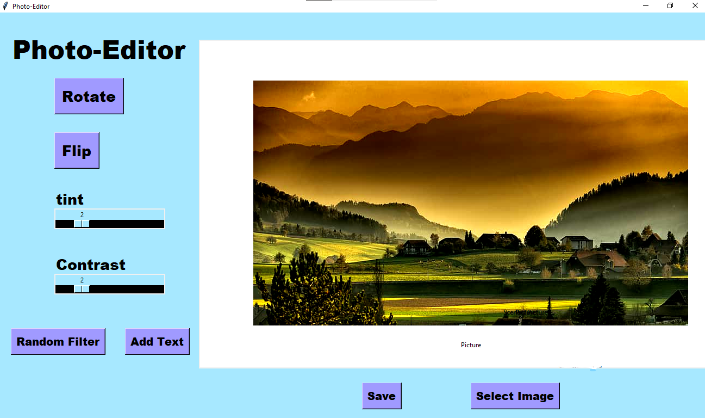

# Photo-Editor

Photo Editor is made by using Python Imaging Library provided by python

The GUI is made using Tkinter library

The fuctionalities are

1.Rotate

2.Contrast

3.Flip

4.Blur

5.Tint

6.Emboss

7.Smooth

8.Add Text

